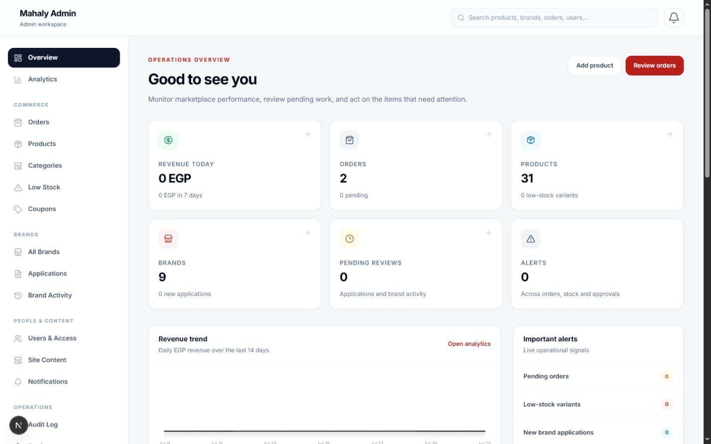
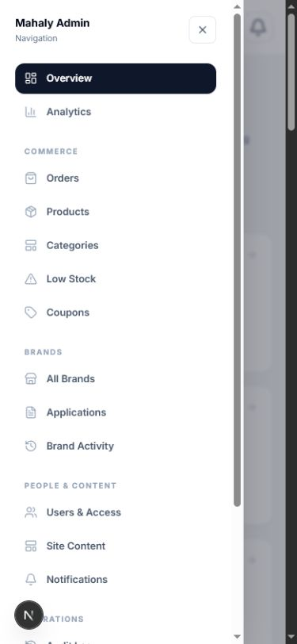
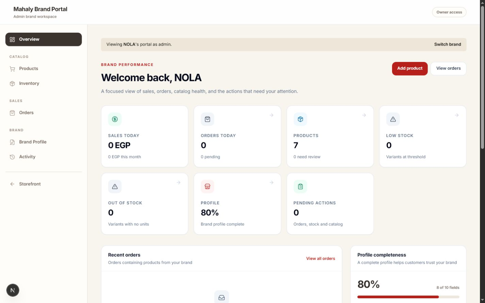
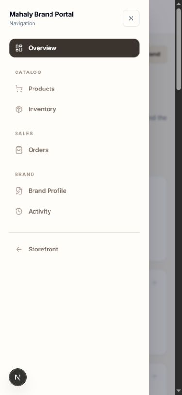

# Admin and Brand Portal redesign

## Scope

This feature redesigns the authenticated Admin Dashboard and Brand Owner Portal without changing storefront pages, database schema, authentication, RLS, or write workflows.

## Navigation

Admin navigation is grouped by real routes:

- Overview and Analytics
- Commerce: Orders, Products, Categories, Low Stock, Coupons
- Brands: All Brands, Applications, Brand Activity
- People & Content: Users & Access, Site Content, Notifications
- Operations: Audit Log, Settings

Brand Activity keeps its existing route (`/admin/products/review`) but now belongs visually to the Brands group.

Brand Portal navigation is intentionally simpler:

- Overview
- Catalog: Products, Inventory
- Sales: Orders
- Brand: Brand Profile, Activity (owner-only)

Both layouts use a full-width desktop workspace and a mobile navigation drawer. No placeholder or dead routes were introduced.

## Reusable UI

- `DashboardShell`: full-width responsive shell and mobile drawer
- `DashboardPageHeader`: consistent titles, descriptions, and actions
- `DashboardStatCard`: real summary metrics and status tones
- `DashboardPanel`: shared content and table surface
- `DashboardFilters`: URL-backed filter layout, active count, and Clear all
- `DashboardEmptyState`, `DashboardLoading`, and `DashboardError`

## Real-data improvements

Admin Overview now surfaces revenue, orders, products, brands, pending reviews, low stock, alerts, recent orders, brand activity, top performers, and admin-only audit activity.

Brand Overview now calculates sales today/month, orders today, pending orders, products, low/out-of-stock variants, profile completeness, pending actions, recent orders, best sellers, and owner-only activity from existing data sources.

No fake metrics are rendered. When data is absent, the UI shows an explicit empty state.

## Filters

- Admin Products: search, status, brand, category, product type, collection, inventory, featured, price, sort
- Admin Orders: search, status, brand, date range, sort, pagination
- Admin Brands: search, category, city, owner link, sort
- Brand Applications: search, status, category, date, sort
- Users: search, role, brand link, join date, sort
- Low Stock: search, brand, urgency, sort
- Brand Activity: search, resolution, activity type, date
- Audit Log: actor, entity, action, date range
- Brand Products: search, status, category, product type, collection, inventory, featured, sort
- Brand Orders: search, status, date range, sort
- Brand Inventory: search, stock level, sort
- Brand Activity: search, action, date

All filters use URL query parameters, preserve unrelated values represented by the form, expose active-filter counts, and support Clear all.

## Security

- Existing Admin and Brand Portal layouts still redirect unauthorized users.
- `requireStaffRole`, `requireBrandOwner`, and Supabase RLS boundaries remain intact.
- Audit summaries remain admin-only.
- Brand Profile and Activity remain owner-only and are hidden from assistants.
- Admin impersonation retains the selected `brand` parameter across portal navigation and product/profile editing.

## Validation

- TypeScript: passed
- ESLint: passed
- Next.js production build: passed with live Supabase access
- Unauthenticated `/admin` redirect: passed
- Unauthenticated `/brand-portal` redirect: passed
- Authenticated Admin overview and navigation: passed
- Admin Products URL-filter persistence after refresh: passed
- Admin Orders, Brands, and Brand Activity filters: passed
- Admin preview of NOLA Brand Portal: passed
- Brand Products URL-filter persistence with `brand=nola`: passed
- Brand Orders, Inventory, Activity, and Profile: passed
- Responsive checks at 1440, 768, and 390 pixels: passed with no page-level horizontal overflow
- Browser console errors across tested routes: none
- Storefront files changed: none
- Production data/schema changes: none

## Authenticated QA screenshots

### Admin desktop overview

### Admin mobile navigation

### Brand Portal desktop overview

### Brand Portal mobile navigation

## Manual QA remaining before merge

Admin access and Admin brand impersonation are verified. A direct Brand Owner session and a Brand Assistant session are still required to confirm their restricted navigation and write permissions before merging the draft PR. Wider 1920 and intermediate 1280/1024 pixel visual checks remain recommended for the deployment preview.
